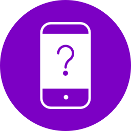

# MobileDetect plugin for Craft CMS 3.x

Use Mobile_Detect for detecting mobile devices (including tablets)



## Requirements

This plugin requires Craft CMS 3.0.0-beta.23 or later.

## Installation

To install the plugin, follow these instructions.

1. Open your terminal and go to your Craft project:

        cd /path/to/project

2. Then tell Composer to load the plugin:

        composer require superbig/craft3-mobiledetect

3. In the Control Panel, go to Settings → Plugins and click the “Install” button for MobileDetect.

## MobileDetect Overview

fairly complete wrapper for the [Mobile_Detect](http://mobiledetect.net/) library by [@serbanghita](https://github.com/serbanghita).**

## Using MobileDetect

The plugin exposes most of Mobile_Detect's methods, and can be used in your Twig:

```twig
{{ craft.mobileDetect.isMobile ? 'I am mobile.' : 'I am not mobile.' }}
```

...or as a PHP service:

```php
<?php
$isMobile = MobileDetect::$plugin->mobileDetect->isMobile();
```

## Methods/usage

### Device detection
```twig
isMobile
```
_Detects all mobile devices, both phones and tablets_

```twig
isTablet
isPhone
```

### Mobile OS detection
```twig
isiOS
isAndroidOS
isBlackBerryOS
isPalmOS
isSymbianOS
isWindowsMobileOS
isWindowsPhoneOS
```

### Other methods

```twig
is(key)
```
_Test for anything, e.g. ```is('iphone')```_

```twig
match(pattern)
```
_Test using regular expressions_

```twig
version(component)
```
_Get the version of a component, e.g. ```version('iPhone')```_

```twig
mobileGrade
```
_Get browser grade (e.g. "A")_

```twig
getScriptVersion
```
_Prints the MobileDetect library's version_

```twig
getUserAgent
setUserAgent(userAgent)
getMobileHeaders
getHttpHeaders
setHttpHeaders(httpHeaders)
getCfHeaders
setCfHeaders(cfHeaders)
```

Brought to you by [Superbig](https://superbig.co)
